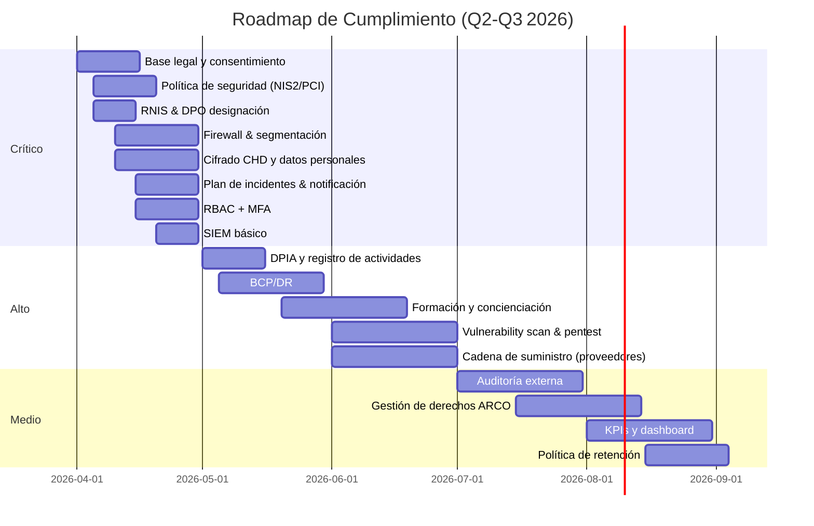

**

# 📊 Informe Ejecutivo de Riesgos y Recomendaciones  
**Destinatarios:** CISO, DPO y Dirección General  
**Fecha:** 15 abril 2026  

---  

## 1. Resumen Ejecutivo  

El análisis de los artefactos encontrados en **/app/evidencias** revela **25 incumplimientos** críticos, altos, medios y de nivel medio, distribuidos entre los marcos regulatorios **GDPR**, **NIS2** y **PCI‑DSS**.  

- **10 riesgos críticos** (40 % del total) comprometen la base legal del tratamiento, la ausencia total de políticas y controles de seguridad, y la falta de mecanismos de cifrado y gestión de incidentes.  
- **9 riesgos altos** (36 %) aumentan la exposición a sanciones y a incidentes de seguridad, especialmente por la falta de DPIA, registro de logs y controles de acceso.  
- **6 riesgos medios** (24 %) dificultan la demostración de cumplimiento y la resiliencia organizacional.  

Si no se atienden de forma inmediata, la empresa se expone a **multas de hasta 4 % de la facturación global o 20 M € (GDPR/NIS2)** y **hasta 2 % de los ingresos o $100 000 por infracción (PCI‑DSS)**, sin contar el daño reputacional y la pérdida de confianza de clientes y socios.

---  

## 2. Visión General de los Riesgos  

| # | Riesgo / Incumplimiento | Marco | Criticidad | Impacto Potencial | Comentario Clave |
|---|--------------------------|-------|------------|-------------------|------------------|
| **1** | Falta de base legal válida para el tratamiento | GDPR | **Crítico** | Multas, suspensión de actividades | Necesario definir Art. 6 válido (p.ej., consentimiento, contrato) |
| **2** | Consentimiento no informado, no específico y no revocable | GDPR | **Crítico** | Sanciones graves, pérdida de confianza | Rediseñar formularios y procesos de revocación |
| **8** | Falta de política de seguridad de la información | NIS2 | **Crítico** | Multas, vulnerabilidad a ciberataques | Crear política integral alineada a NIS2 |
| **9** | Ausencia de gestión de riesgos de ciberseguridad | NIS2 | **Crítico** | Exposición a incidentes, sanciones | Implementar proceso de gestión de riesgos (ISO 27005) |
| **10** | Falta de medidas técnicas y organizativas (firewalls, control de accesos, cifrado, etc.) | NIS2 | **Crítico** | Brechas, multas | Desplegar controles de defensa en profundidad |
| **11** | Inexistencia de plan de gestión de incidentes y notificación | NIS2 | **Crítico** | Incumplimiento de notificación 24 h, multas | Definir SOP de respuesta y registro |
| **18** | Ausencia total de controles de seguridad de la información (PCI‑DSS) | PCI‑DSS | **Crítico** | Multas, fraude con tarjetas | Implementar todos los requisitos PCI‑DSS |
| **19** | No se protege ni cifra datos de titulares de tarjetas (CHD) | PCI‑DSS | **Crítico** | Robo de datos, alta pérdida financiera | Cifrar CHD en reposo y tránsito (AES‑256, TLS 1.3) |
| **20** | Falta de control de acceso y principio de menor privilegio | PCI‑DSS | **Crítico** | Acceso ilimitado, alto riesgo de compromiso | Implementar RBAC, MFA, revisión de privilegios |
| **21** | No hay registro y monitoreo de eventos de seguridad | PCI‑DSS | **Alto** | Imposibilidad de detección, incumplimiento | Implementar SIEM con retención 12 meses |
| **22** | No se realizan pruebas de vulnerabilidad ni penetración | PCI‑DSS | **Alto** | Vulnerabilidades sin detectar, sanciones | Programar escaneos trimestrales y pentests anuales |
| **23** | No existe política de seguridad de la información (PCI‑DSS) | PCI‑DSS | **Alto** | Falta de marco de gobernanza | Consolidar política PCI‑DSS con la de NIS2 |
| **24** | No hay gestión de incidentes ni plan de respuesta (PCI‑DSS) | PCI‑DSS | **Alto** | Respuesta tardía, incumplimiento | Unificar plan de incidentes NIS2/PCI‑DSS |
| **...** | *(Riesgos 3‑7, 12‑17, 25 – detalle en anexo)* | | | | |

> **Nota:** El anexo al final del documento contiene la tabla completa con los 25 riesgos.

---  

## 3. Prioridades de Acción  

### 3.1. **Acciones Inmediatas (0‑30 días)** – Riesgos Críticos  
| Acción | Responsable | Entregable | Fecha límite |
|--------|------------|------------|--------------|
| **A1** – Definir y documentar bases legales y mecanismos de consentimiento** | DPO + Legal | Matriz de bases legales (Art. 6) y nuevo formulario de consentimiento con opción de revocación | 15 abr 2026 |
| **A2** – Crear política de seguridad de la información (NIS2 & PCI‑DSS)** | CISO | Política aprobada por la Dirección, alineada a NIS2 Art. 5 y PCI‑DSS Req. 12 | 20 abr 2026 |
| **A3** – Designar Responsable de Seguridad (RNIS) y Delegado de Protección de Datos (DPO)** | Dirección | Nombramiento formal y registro en autoridad competente | 18 abr 2026 |
| **A4** – Implementar firewall perimetral y segmentación de red** | Infraestructura | Arquitectura de red con DMZ, reglas de firewall documentadas | 30 abr 2026 |
| **A5** – Desplegar cifrado de datos en reposo y tránsito (CHD y datos personales)** | Infraestructura / Desarrollo | TLS 1.3 en todos los canales, cifrado AES‑256 en bases de datos | 30 abr 2026 |
| **A6** – Establecer plan de gestión de incidentes y proceso de notificación 24 h** | CISO + DPO | SOP, registro de incidentes, plantilla de notificación a autoridad | 30 abr 2026 |
| **A7** – Implementar control de acceso basado en roles (RBAC) y MFA para cuentas privilegiadas** | Seguridad | Matriz de roles, MFA habilitado en todos los accesos críticos | 30 abr 2026 |
| **A8** – Configurar registro de logs de seguridad y SIEM básico** | Seguridad | Log collection de firewalls, servidores, aplicaciones; retención 12 meses | 30 abr 2026 |

### 3.2. **Acciones a Corto Plazo (30‑90 días)** – Riesgos Altos  
| Acción | Responsable | Entregable | Fecha límite |
|--------|------------|------------|--------------|
| **B1** – Realizar DPIA para todos los tratamientos de marketing** | DPO | Informe DPIA con mitigaciones y registro | 15 may 2026 |
| **B2** – Implementar registro de actividades de tratamiento (Art. 30 GDPR)** | DPO | CSV completo con responsables, bases legales, transferencias | 20 may 2026 |
| **B3** – Desarrollar y probar plan de continuidad del negocio (BCP) y recuperación (DR)** | CISO | Documentación BCP/DR, pruebas de backup | 31 may 2026 |
| **B4** – Establecer programa de formación y concienciación en ciberseguridad (GDPR, NIS2, PCI‑DSS)** | RR.HH. + CISO | Curso e‑learning, 100 % del personal certificado | 15 jun 2026 |
| **B5** – Ejecutar escaneo de vulnerabilidades y pruebas de penetración** | Seguridad | Informe de vulnerabilidades, plan de remediación | 30 jun 2026 |
| **B6** – Formalizar acuerdos de seguridad con proveedores (cadena de suministro)** | Procurement + CISO | Contratos con cláusulas de seguridad, evaluación de riesgos | 30 jun 2026 |
| **B7** – Implementar auditorías internas de seguridad (ISO 27001)** | Auditoría Interna | Programa de auditoría trimestral, primer informe | 30 jun 2026 |

### 3.3. **Acciones a Mediano Plazo (90‑180 días)** – Riesgos Medios  
| Acción | Responsable | Entregable | Fecha límite |
|--------|------------|------------|--------------|
| **C1** – Realizar auditoría externa de cumplimiento (GDPR, NIS2, PCI‑DSS)** | Auditoría externa | Informe de auditoría con hallazgos y plan de acción | 30 sep 2026 |
| **C2** – Documentar y publicar política de gestión de incidentes (PCI‑DSS Req. 12)** | CISO | Política alineada a NIS2 y PCI‑DSS | 30 sep 2026 |
| **C3** – Implementar proceso de gestión de derechos de los interesados (acceso, supresión, portabilidad)** | DPO | Portal de autoservicio, SLA 30 días | 30 sep 2026 |
| **C4** – Establecer métricas de seguridad (KPIs) y tablero de mando** | CISO | Dashboard con indicadores: tiempo de detección, % de parches aplicados, número de incidentes | 30 sep 2026 |
| **C5** – Revisar y actualizar criterios de retención de datos** | DPO | Política de retención con plazos definidos y borrado seguro | 30 sep 2026 |

---  

## 4. Hoja de Ruta (Roadmap)  

---  

## 5. Responsabilidades y Gobernanza  

| Área | Rol | Responsabilidades Clave |
|------|-----|--------------------------|
| **Dirección** | CEO / Consejo | Aprobar presupuesto, validar políticas, supervisar cumplimiento regulatorio. |
| **CISO** | Responsable de Seguridad de la Información (RNIS) | Definir e implementar controles técnicos, gestionar incidentes, liderar pruebas de vulnerabilidad, reportar KPIs. |
| **DPO** | Delegado de Protección de Datos | Garantizar bases legales, gestionar consentimientos, DPIA, derechos ARCO, actuar como punto de contacto con autoridades. |
| **Legal** | Asesor Jurídico | Revisar y validar bases legales, contratos con terceros, cláusulas de seguridad. |
| **TI / Infraestructura** | Arquitecto de Seguridad | Implementar firewalls, segmentación, cifrado, MFA, SIEM. |
| **RR.HH.** | Responsable de Formación | Coordinar programa de concienciación y certificaciones. |
| **Auditoría Interna** | Auditor | Ejecutar auditorías periódicas, seguimiento de hallazgos. |
| **Procurement** | Gestión de Proveedores | Evaluar riesgos de la cadena de suministro, incluir cláusulas de seguridad en contratos. |

---  

## 6. Métricas de Seguimiento (KPIs)  

| KPI | Umbral objetivo | Frecuencia de medición | Responsable |
|-----|-----------------|------------------------|-------------|
| **% de procesos con base legal válida** | 100 % | Mensual | DPO |
| **Tiempo medio de detección (MTTD) de incidentes** | ≤ 4 h | Mensual | CISO |
| **Tiempo medio de respuesta (MTTR) a incidentes** | ≤ 24 h | Mensual | CISO |
| **% de usuarios con MFA habilitado** | 100 % | Mensual | TI |
| **Número de vulnerabilidades críticas no remediadas** | 0 | Semanal | Seguridad |
| **% de empleados completando formación de seguridad** | 100 % | Trimestral | RR.HH. |
| **Incidentes notificados dentro del plazo legal (24 h)** | 100 % | Mensual | CISO/DPO |
| **% de registros de logs retenidos ≥ 12 meses** | 100 % | Mensual | Seguridad |
| **Resultado de auditoría externa (conformidad)** | ≥ 95 % | Anual | Auditoría externa |

---  

## 7. Conclusiones  

1. **Urgencia crítica:** La falta de bases legales y de controles de seguridad básicos expone a la organización a sanciones multimillonarias y a un riesgo inaceptable de brechas de datos.  
2. **Enfoque estructurado:** La hoja de ruta propuesta permite abordar primero los riesgos que amenazan la existencia legal de la empresa (críticos), seguido de los que aumentan la probabilidad de incidentes (altos) y, finalmente, los que mejoran la capacidad de demostrar cumplimiento (medios).  
3. **Compromiso de la alta dirección:** La asignación de recursos (presupuesto, personal y tiempo) y el patrocinio visible de la Dirección son imprescindibles para lograr la remediación dentro de los plazos establecidos.  
4. **Cultura de cumplimiento:** La combinación de políticas, formación y métricas crea un ciclo de mejora continua que alineará a la empresa con GDPR, NIS2 y PCI‑DSS a medio y largo plazo.  

---  

## 8. Anexo – Tabla Completa de Riesgos  

| # | Riesgo / Incumplimiento | Marco Regulatorio | Descripción del Hallazgo | Impacto Potencial | Criticidad | Justificación |
|---|--------------------------|-------------------|--------------------------|-------------------|------------|----------------|
| 1 | Falta de base legal válida para el tratamiento de datos personales | GDPR | La política indica recolección de datos “para marketing sin consentimiento explícito” y el registro muestra “legal_basis = marketing”, que no corresponde a ninguna base legal del Art. 6. | Multas de hasta 4 % de la facturación global o 20 M €, suspensión de actividades. | Crítico | Incumplimiento directo de la base legal, requisito esencial del GDPR. |
| 2 | Consentimiento no informado, no específico y no revocable | GDPR | El formulario de consentimiento obliga al interesado a aceptar cualquier propósito y no permite retirar el consentimiento. | Sanciones graves, pérdida de confianza, riesgo de demandas. | Crítico | El consentimiento es un pilar del GDPR; su ausencia invalida todo el tratamiento. |
| 3 | Falta de información a los interesados (derechos, plazos, destinatarios) | GDPR | La política no menciona derechos de los sujetos, plazos de conservación ni destinatarios. | Multas y reclamos de los titulares. | Alto | Afecta la transparencia, pero el tratamiento ya es ilegal por falta de base legal. |
| 4 | Conservación indefinida de datos personales | GDPR | Política declara almacenamiento indefinido sin criterios de retención. | Violación del principio de limitación del plazo, posible sanción. | Alto | Riesgo de exposición prolongada de datos. |
| 5 | Derechos de los interesados no garantizados (acceso, supresión, portabilidad, etc.) | GDPR | No existen procedimientos ni canales para ejercer dichos derechos. | Multas y reclamaciones de los titulares. | Alto | Compromete la capacidad de cumplir con solicitudes de los sujetos. |
| 6 | Registro de actividades de tratamiento incompleto | GDPR | CSV carece de responsable, encargado, medidas de seguridad, destinatarios, transferencias. | Multas por incumplimiento del Art. 30. | Alto | Registro insuficiente impide auditoría y control. |
| 7 | Ausencia de Evaluación de Impacto de Protección de Datos (DPIA) | GDPR | No se evidencia ninguna DPIA pese al tratamiento de datos de marketing. | Multas y obligación de realizar DPIA retroactiva. | Alto | DPIA es obligatoria cuando el tratamiento implica riesgos altos. |
| 8 | Falta de política de seguridad de la información | NIS2 | Sólo existe política de privacidad; no hay política de seguridad que cubra objetivos, roles y medidas. | Multas de hasta 10 % de la facturación global o 20 M €, vulnerabilidad a ciberataques. | Crítico | La política es requisito básico de NIS2; su ausencia deja a la organización sin marco de gobernanza. |
| 9 | Ausencia de gestión de riesgos de ciberseguridad | NIS2 | No hay análisis de riesgos, evaluaciones de vulnerabilidades ni planes de mitigación. | Exposición a incidentes, sanciones y daño reputacional. | Crítico | Gestión de riesgos es núcleo de NIS2; su falta implica incumplimiento total. |
| 10 | Falta de medidas técnicas y organizativas (firewalls, control de accesos, cifrado, etc.) | NIS2 | No se evidencia ninguna medida de protección técnica. | Alta probabilidad de brechas, sanciones. | Crítico | Sin controles técnicos la red es totalmente vulnerable. |
| 11 | Inexistencia de plan de gestión de incidentes y notificación | NIS2 | No hay documento de respuesta a incidentes ni registro de incidentes. | Incumplimiento del plazo de 24 h de notificación, multas. | Crítico | La obligación de notificar es mandataria; su ausencia es grave. |
| 12 | Falta de continuidad del servicio y planes de recuperación | NIS2 | No existen planes de backup, recuperación ni pruebas de resiliencia. | Interrupciones prolongadas, sanciones y pérdida de negocio. | Alto | Afecta disponibilidad, pero menos inmediato que la ausencia de controles básicos. |
| 13 | Ausencia de controles de la cadena de suministro | NIS2 | No hay evaluaciones de proveedores ni acuerdos de seguridad. | Riesgo de compromisos a través de terceros, sanciones. | Alto | Importante pero secundario a la falta de controles internos. |
| 14 | No hay auditorías internas/externas de seguridad | NIS2 | No se presentan evidencias de auditorías. | Falta de evidencia de cumplimiento, sanciones. | Medio | Necesario para demostrar cumplimiento, pero no tan crítico como la ausencia de políticas. |
| 15 | No existe programa de formación y concienciación en ciberseguridad | NIS2 | No se menciona capacitación del personal. | Mayor probabilidad de errores humanos, sanciones. | Medio | Relevante pero de menor peso frente a controles técnicos ausentes. |
| 16 | Falta de registro de actividades de seguridad (logs de eventos) | NIS2 | Sólo se tiene CSV de procesamiento de datos, no logs de seguridad. | Imposibilidad de detección y respuesta a incidentes. | Alto | Crucial para detección y trazabilidad. |
| 17 | No hay designación de responsable de seguridad (RNIS) | NIS2 | No se identifica a un responsable ni punto de contacto. | Incumplimiento de gobernanza, sanciones. | Alto | Obligatorio para la autoridad competente. |
| 18 | Ausencia total de controles de seguridad de la información (PCI‑DSS) | PCI‑DSS | No hay firewall, cifrado, gestión de accesos, anti‑malware, etc. | Multas de hasta 2 % de ingresos o $100 000 por infracción, riesgo de fraude con tarjetas. | Crítico | PCI‑DSS exige todos estos controles; su falta expone a graves brechas de datos de tarjetas. |
| 19 | No se protege ni cifra datos de titulares de tarjetas (CHD) | PCI‑DSS | No hay evidencia de cifrado en reposo ni en tránsito. | Exposición directa de datos de tarjetas, alto riesgo de robo. | Crítico | Violación directa del requisito 3 y 4, con alto potencial de pérdida financiera. |
| 20 | Falta de control de acceso y principio de menor privilegio | PCI‑DSS | No existen usuarios, roles ni MFA. | Acceso ilimitado a sistemas críticos, alto riesgo de compromiso. | Crítico | Requisito esencial de los requisitos 7 y 8. |
| 21 | No hay registro y monitoreo de eventos de seguridad | PCI‑DSS | Sólo registro de marketing, no logs de seguridad. | Imposibilidad de detección de incidentes, incumplimiento del requisito 10. | Alto | Necesario para auditoría y respuesta. |
| 22 | No se realizan pruebas de vulnerabilidad ni penetración | PCI‑DSS | No hay evidencia de escaneos ni pruebas. | Vulnerabilidades sin detectar, sanciones del requisito 11. | Alto | Requisito de pruebas regulares. |
| 23 | No existe política de seguridad de la información (PCI‑DSS) | PCI‑DSS | Sólo política de privacidad. | Falta de marco de gobernanza, incumplimiento del requisito 12. | Alto | Base para todo el programa de cumplimiento. |
| 24 | No hay gestión de incidentes ni plan de respuesta (PCI‑DSS) | PCI‑DSS | Ausencia de proceso documentado. | Incumplimiento del requisito 12 y riesgo de respuesta tardía. | Alto | Crucial para mitigar brechas. |
| 25 | No hay capacitación del personal en requisitos PCI‑DSS | PCI‑DSS | No se menciona entrenamiento. | Mayor probabilidad de errores operativos. | Medio | Importante pero menos crítico que la falta de controles técnicos. |

---  

**Fin del informe**.  Para cualquier aclaración o ampliación, quedo a disposición del CISO, DPO y la Dirección.